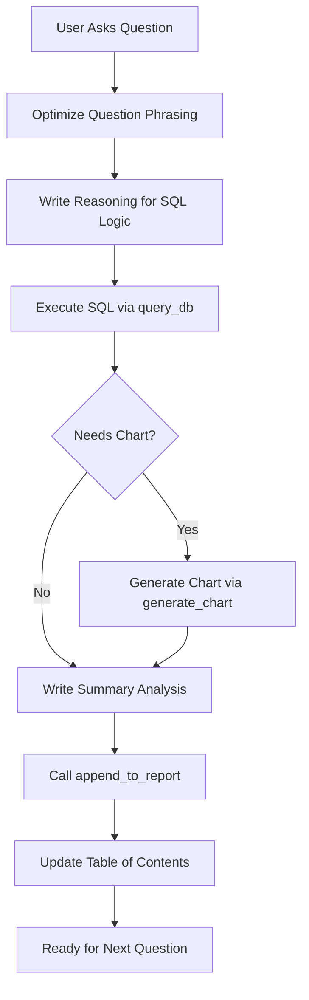

# Trends QA Agent

A reproducible Q&A analysis system for monthly retail trends data using SQLite and Python.

---

## Quick Start

```bash
# 1. Navigate to the project directory
cd postgress_qa_agent

# 2. Install dependencies with uv
uv sync

# 3. Initialize the database (loads CSV into SQLite)
uv run python qa_agent.py

# 4. Start asking questions!
```

---

## Dataset Schema

The database `trends.db` contains a single table `trends`:

| Column | Type | Description | Example Values |
|--------|------|-------------|----------------|
| `month` | DATE | Monthly timestamp (YYYY-MM-DD) | 2019-01-01, 2025-12-01 |
| `merchant` | TEXT | Retailer name | nike, amazon_leia, target, kohls |
| `l1` | TEXT | Category Level 1 | Apparel, Footwear |
| `l2` | TEXT | Category Level 2 | Tops, Bottoms, Dresses |
| `l3` | TEXT | Category Level 3 | Athletic Shirts, Skirts |
| `gender` | TEXT | Target gender | Kids, Men's, Women's, Unisex/Undefined |
| `fop` | TEXT | Form of Product | sportswear, basketball, running, hiking |
| `sub_sport` | TEXT | Sport subcategory | null, various sports |
| `gmv` | REAL | Gross Merchandise Value | 3.98E7 (sales volume) |
| `source` | TEXT | Data version indicator | 'new' or 'old' |

---

## Workflow for Each Question

Follow these steps for EVERY question:

### Step 1: Optimize the Question

Transform the user's raw question into a clear, analytical query.

| Raw Question | Optimized Question |
|--------------|-------------------|
| "how much did nike sell?" | "Total GMV for Nike Across All Categories (2024)" |
| "which merchants in each version?" | "Comparative Analysis of Merchant Presence Across Data Versions (Old vs. New)" |

### Step 2: Write the Reasoning

Explain your SQL logic:
- What columns are you selecting and why?
- What filters (WHERE) are you applying?
- Are you using CTEs to establish scope (e.g., months/merchants from 'old' version)?

### Step 3: Write and Execute the SQL Query

```python
from qa_agent import query_db

sql = """
SELECT merchant, SUM(gmv) as total_gmv
FROM trends
WHERE source = 'new'
GROUP BY merchant
ORDER BY total_gmv DESC;
"""
results = query_db(sql)
print(results)
```

### Step 4: Generate Visualization (if needed)

Create a chart if the data shows trends, comparisons, or distributions:

```python
from qa_agent import generate_chart

# Simple bar chart
chart_path = generate_chart(
    df=results,
    x='merchant',
    y='total_gmv',
    title='Total GMV by Merchant',
    filename='merchant_gmv.png',
    chart_type='bar'
)

# Grouped bar chart (for old vs new comparisons)
chart_path = generate_chart(
    df=pivoted_df,
    x='merchant',
    y='share',
    title='Market Share Comparison',
    filename='share_comparison.png',
    chart_type='grouped_bar',
    hue='source'
)
```

### Step 5: Write the Summary Analysis

This is the most critical step. Write a high-precision, critical analysis:

**DO:**
- Highlight the largest changes or anomalies (e.g., "Dick's lost 21.89 percentage points")
- Flag data quality issues (e.g., "This suggests a change in attribution methodology")
- Explain business impact (e.g., "Target's gain indicates systematic underreporting in the old version")
- Use specific numbers from the results

**DON'T:**
- Write generic summaries like "The data shows interesting trends"
- Ignore outliers or suspicious patterns
- Trust the data blindly without questioning methodology changes

### Step 6: Append to Report

```python
from qa_agent import append_to_report

question_num = append_to_report(
    question="Total GMV by Merchant (New Data Version)",
    reasoning="Aggregating GMV by merchant to understand market concentration...",
    sql_query=sql,
    results_df=results,
    raw_question="how much did each merchant sell?",
    image_path=chart_path,  # Optional
    summary="Nike leads with $X.XX billion (XX%), followed by..."
)
```

### Step 7: Update Table of Contents

After adding a new question, update the TOC at the top of `report.md`:

```markdown
## Table of Contents

1. [Question Title Here](#question-1-question-title-here)
2. [Next Question](#question-2-next-question)
...
```

---

## Report Format Specification

Every entry in `report.md` MUST follow this exact structure:

```markdown
## Question X: [Optimized Question Title]
*Raw question: [User's original question]*

### Reasoning
[Detailed explanation of SQL logic]

### SQL Query
```sql
[Your SQL code here]
```

### Results

[Markdown table with query results]

### Visualization


### Summary Analysis


[Critical analysis with specific numbers and insights]

---
```

**CRITICAL FORMATTING RULES:**
1. Question headers MUST be numbered: `## Question 1:`, `## Question 2:`, etc.
2. Two blank lines after `### Summary Analysis` header
3. One blank line before the `---` separator
4. These spacing rules ensure proper PDF rendering

---

## Code Reference

### `init_db()`
Loads CSV into SQLite if database doesn't exist.

```python
from qa_agent import init_db
init_db()  # Creates trends.db from old_and_new_thrends.csv
```

### `reload_db()`
Force reload CSV into SQLite (use when CSV is updated).

```python
from qa_agent import reload_db
reload_db()  # Deletes and recreates trends.db
```

### `query_db(sql)`
Execute SQL query and return pandas DataFrame.

```python
from qa_agent import query_db
df = query_db("SELECT DISTINCT merchant FROM trends")
```

### `get_next_question_number()`
Returns the next question number by parsing report.md.

```python
from qa_agent import get_next_question_number
next_num = get_next_question_number()  # Returns 15 if last question was 14
```

### `append_to_report(...)`
Append a Q&A entry with auto-numbering and PDF-friendly formatting.

```python
from qa_agent import append_to_report

append_to_report(
    question="Optimized question title",
    reasoning="Explanation of SQL logic...",
    sql_query="SELECT ...",
    results_df=df,
    raw_question="user's original question",  # Optional
    image_path="images/chart.png",            # Optional
    summary="Critical analysis text..."        # Optional
)
```

### `generate_chart(...)`
Generate and save a chart.

```python
from qa_agent import generate_chart

filepath = generate_chart(
    df=dataframe,
    x='column_for_x_axis',
    y='column_for_y_axis',
    title='Chart Title',
    filename='output.png',
    chart_type='bar',  # 'line', 'bar', or 'grouped_bar'
    hue='grouping_column'  # Optional, for grouped charts
)
```

### `clear_images()`
Remove all PNG files from images/ directory.

```python
from qa_agent import clear_images
clear_images()  # Clears all charts
```

---

## PDF Export Instructions

The report is formatted for clean PDF export. To generate a PDF:

**Option 1: Cursor IDE (Recommended)**
- Right-click on `report.md` → Print to PDF

**Option 2: Pandoc (requires LaTeX)**
```bash
pandoc report.md -o report.pdf --pdf-engine=xelatex
```

**Option 3: Online Converters**
- Use markdown-pdf.com or similar services

---

## Common Analysis Patterns

### Market Share Comparison (Old vs New)

```sql
WITH scope AS (
    SELECT DISTINCT month, merchant 
    FROM trends 
    WHERE source = 'old'
),
filtered_data AS (
    SELECT t.source, t.merchant, t.gmv
    FROM trends t
    JOIN scope s ON t.month = s.month AND t.merchant = s.merchant
    WHERE LOWER(t.fop) LIKE '%basketball%'
),
totals AS (
    SELECT source, SUM(gmv) as total_gmv
    FROM filtered_data
    GROUP BY source
),
shares AS (
    SELECT d.merchant, d.source,
           SUM(d.gmv) * 100.0 / t.total_gmv as share
    FROM filtered_data d
    JOIN totals t ON d.source = t.source
    GROUP BY d.merchant, d.source
)
SELECT 
    merchant,
    ROUND(MAX(CASE WHEN source = 'old' THEN share ELSE 0 END), 2) as old_share_pct,
    ROUND(MAX(CASE WHEN source = 'new' THEN share ELSE 0 END), 2) as new_share_pct,
    ROUND(MAX(CASE WHEN source = 'new' THEN share ELSE 0 END) - 
          MAX(CASE WHEN source = 'old' THEN share ELSE 0 END), 2) as share_diff
FROM shares
GROUP BY merchant
ORDER BY old_share_pct DESC;
```

### Valid L2 Filter (Apparel Analysis)

When analyzing Apparel, exclude "Other Apparel" for cleaner results:

```sql
WHERE LOWER(l1) = 'apparel'
  AND l2 IS NOT NULL
  AND LOWER(l2) NOT LIKE '%other%'
```

---

## Workflow Diagram


